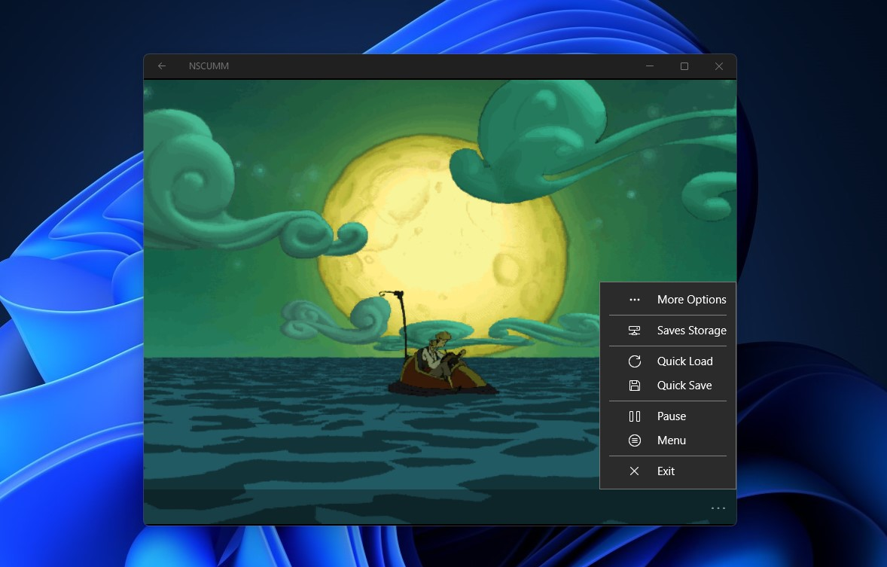

   
  <b>Enhanced Scumm Engine (UWP) based on NScumm by scemino</b> 
  <a href="./src">Source</a> |
  <a href="https://github.com/scemino/nscumm">Original Project</a> 
    
    

# Important
WIP project for testing usage, original ScummVM is working better

# Features
- Export/Import Saves
- Shortcuts for touch screens
- Layouts improvement
- Bugs fixes

# Known Issue

- GC (Garbage Collector) causing low performance

# Target

It will work with build 10240 and above, ARM - x64 - x86

# Supported Games

Check SupportedGames.txt

# Credits

Developed by Scemino

Enhanced by Bashar Astifan

